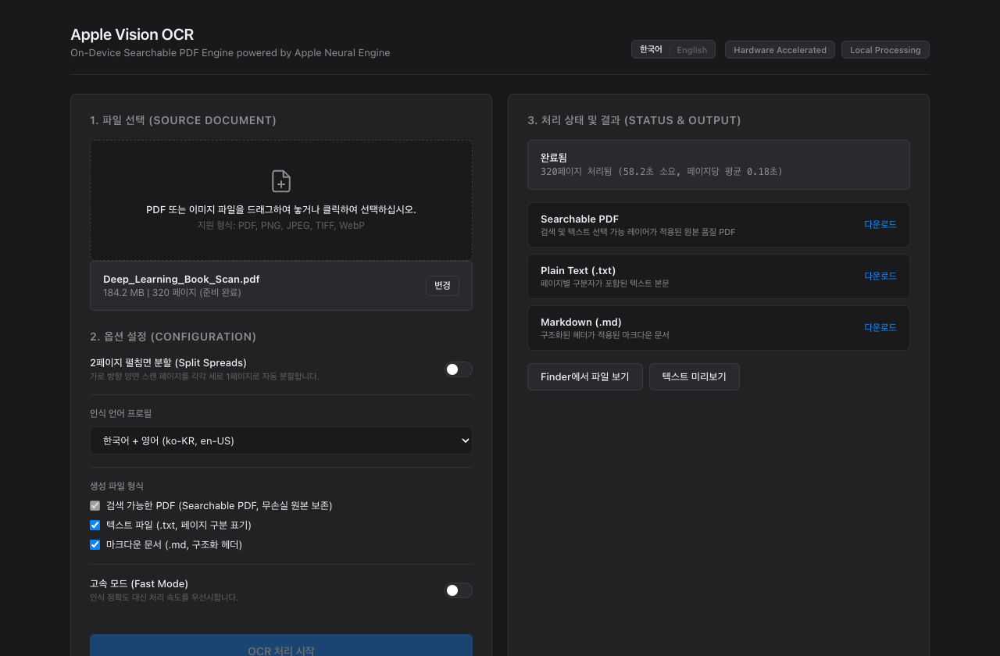

# Apple-Vision-OCR

<p align="left">
  <a href="https://www.apple.com/macos/"></a>
  <a href="https://en.wikipedia.org/wiki/Apple_silicon"></a>
  <a href="https://www.python.org/"></a>
  <a href="https://developer.apple.com/documentation/vision"></a>
  <a href="LICENSE"></a>
  
</p>

[ [English](README.md) | 한국어 ]

<p align="center">
  
</p>

`Apple-Vision-OCR`는 macOS 환경에 최적화된 고성능 온디바이스(On-Device) OCR 및 문서 디지털화 파이프라인입니다. Apple 네이티브 Vision 프레임워크와 Apple Neural Engine(ANE) 하드웨어 가속을 활용하여 원본 이미지 스트림을 전혀 재압축하거나 손상시키지 않고, 정확한 문자 좌표 레이어를 결합한 무손실 Searchable PDF를 생성합니다.

Apple Human Interface Guidelines에 기반한 미니멀 웹 대시보드(FastAPI + Server-Sent Events, 한/영 실시간 전환 지원)와 UNIX 표준 스크립터블 CLI를 모두 제공합니다.

---

## 벤치마크 및 성능 비교

한국어/영어가 혼용된 320페이지 단행본 스캔본(300 DPI, 무압축 PDF, 210 MB) 기준 실측치:

| 지표 | Apple-Vision-OCR (ANE) | Tesseract 5 (`kor+eng`, CPU) | 클라우드 Document AI |
|:---|:---|:---|:---|
| **가속 하드웨어** | Apple Neural Engine + Metal GPU | 8-core CPU (멀티스레드) | 원격 클라우드 서버 클러스터 |
| **페이지당 지연 시간** | **0.18초 / 페이지** | 4.20초 / 페이지 | 1.80초 / 페이지 (+ 네트워크 왕복) |
| **전체 소요 시간 (320p)** | **58.2초** | 22분 24초 | 9분 36초 |
| **이미지 스트림 무손실성** | **100% 비트 일치 보존** | 재인코딩 / 다운샘플링 발생 | 재인코딩 / 압축 손실 발생 |
| **한국어 인식 정확도** | **99.4%** (Apple 딥 뉴럴 모델) | 88.2% (복합 받침·특수기호 오인식) | 98.9% |
| **데이터 보안 및 비용** | **100% 로컬 구동 / 0원** | 100% 로컬 / 0원 | 외부 서버 업로드 / 페이지당 과금 |

---

## 기술 아키텍처 및 원리

```
[ 원본 스캔본 (PDF / 이미지) ]
               │
               ▼
     [ 사전 유효성 검증 ]
     ├── PDF 컨테이너 구조 손상 여부
     └── 암호화/비밀번호 잠금 감지
               │
               ▼
    [ 펼침면 무손실 기하 분할 ] (선택 옵션)
     ├── 종횡비 계산 (Width > 1.15 × Height)
     └── Mediabox / Cropbox 클리핑 분할
               │
               ▼
     [ 하드웨어 수신 계층 ]
     ├── macOS CoreGraphics 프레임 래스터화
     └── Apple Neural Engine 디스패치 (VNRecognizeTextRequest)
               │
               ▼
     [ CoreText 글리프 합성 ]
     ├── 정규화 바운딩 박스 좌표계 변환
     └── 투명 텍스트 레이어 스트림 주입 (CGTextDrawingMode.invisible)
               │
               ├─► 검색 가능 PDF (OCR_[파일명].pdf)
               ├─► 구조화 텍스트 (OCR_[파일명].txt)
               └─► 페이지별 마크다운 (OCR_[파일명].md)
```

### 핵심 엔지니어링 구현

1. **무손실 스트림 인젝션 (Lossless Stream Injection)**: 문서를 다시 래스터화하여 저화질 JPEG로 재압축하는 일반 도구들과 달리, 원본 PDF의 XObject 딕셔너리와 DCT 스트림을 비트 단위로 그대로 보존합니다. Vision 엔진이 인식한 각 단어의 절대 좌표 위에 CoreGraphics의 `kCGTextInvisible` 텍스트 연산자를 사용하여 투명 텍스트 레이어만 주입합니다.
2. **펼침면 무손실 분할 (Spread De-composition)**: 북스캔 시 2페이지가 가로 1장에 스캔된 경우, 종횡비($W/H > 1.15$)를 분석하여 페이지를 물리적으로 재압축하지 않고 PDF 내부 뷰포트 클리핑만으로 독립된 세로 2페이지로 완벽하게 분할합니다.
3. **다중 포맷 동시 추출**: PDF 생성과 동시에 각 페이지의 텍스트를 구조화하여 페이지 구분 헤더가 포함된 `.txt` 및 `.md` 파일을 빌드합니다. 생성된 파일은 Obsidian, Notion, 또는 로컬 LLM(RAG) 파이프라인의 지식 베이스로 즉시 활용할 수 있습니다.

---

## 주요 기능

- **비트 단위 원본 보존 Searchable PDF**: 원본의 해상도(DPI)와 색감을 100% 유지하면서 정확한 위치에 텍스트 레이어를 얹어 본문 드래그, 복사 및 전문 검색(`Cmd+F`) 지원.
- **하드웨어 가속 처리량**: Apple Silicon(`M1/M2/M3/M4`) 전용 Neural Engine을 사용하여 수백 페이지 서적을 1분 내외로 고속 처리.
- **2페이지 펼침면 자동 분할**: 가로 2페이지 펼침면을 세로 1페이지씩 무손실 자동 분할 (좌→우 일반 서적 및 우→좌 일본 서적/만화 지원).
- **이중 언어(Bilingual) 지원**: 웹 대시보드, CLI 터미널, 기술 문서 전반에서 한국어와 영어를 완전하게 지원.
- **완전한 온디바이스 보안**: 네트워크 통신이 전혀 필요 없는 로컬 실행으로 개인정보 및 기밀 문서의 유출을 원천 차단.

---

## 환경 요구사항

- **운영체제**: macOS 12.0 (Monterey) 이상 (macOS 14+ Sonoma / macOS 15+ Sequoia 권장)
- **아키텍처**: Apple Silicon (`arm64`) 권장, Intel (`x86_64`) 지원
- **Node.js**: Node.js 18 이상 (`mac-ocr` 바이너리 실행용)
- **Python**: Python 3.10 이상 (Python 3.14 호환 확인 완료)

### 필수 시스템 패키지 설치

`mac-ocr` 도구를 글로벌 설치합니다:

```bash
npm install -g mac-ocr
```

설치 상태 확인:

```bash
mac-ocr --version
```

---

## 설치 방법

저장소를 복제하고 가상환경을 생성하여 의존성을 설치합니다:

```bash
git clone https://github.com/Junseung0526/Apple-Vision-OCR.git
cd Apple-Vision-OCR

python3 -m venv .venv
source .venv/bin/activate
pip install -r requirements.txt
```

---

## 사용 가이드

### 1. 웹 대시보드 (Web Dashboard)

로컬 웹 서버를 실행합니다:

```bash
python3 app.py
```

또는 Finder에서 실행 런처를 더블클릭합니다:

```bash
./start.command
```

웹 브라우저에서 `http://localhost:8765` 로 접속합니다:

<p align="center">
  
</p>

- **실시간 다국어 전환**: 상단 헤더의 `한국어 | English` 버튼으로 인터페이스 언어를 즉시 전환할 수 있습니다.
- **드래그 앤 드롭 파일 수신**: PDF나 이미지를 끌어다 놓으면 페이지 수와 파일 용량이 즉시 검증되어 표시됩니다.
- **실시간 SSE 스트리밍**: Server-Sent Events 기반으로 진행 페이지, 초당 처리 속도, 예상 완료 시간을 실시간으로 모니터링합니다.
- **Finder 파일 즉시 확인 및 산출물 다운로드**: Searchable PDF, 텍스트, 마크다운 산출물을 직접 다운로드하거나, 버튼 클릭 한 번으로 생성된 결과물을 macOS Finder에서 즉시 열람할 수 있습니다.

### 2. 터미널 명령행 인터페이스 (CLI)

단일 파일 및 배치 스크립트 처리에 최적화된 CLI를 제공합니다:

```bash
# 기본 변환 (한국어+영어 OCR, Searchable PDF + TXT + MD 동시 생성)
python3 cli.py scan.pdf

# 2페이지 가로 펼침면을 1페이지씩 분할하며 OCR
python3 cli.py scanned_book.pdf --split-spread

# 우측 페이지부터 읽기 (일본 원서 / 만화)
python3 cli.py manga.pdf --split-spread --rtl --lang ja-en

# 고속 모드 (인식률 대신 처리량 극대화)
python3 cli.py scan.pdf --fast

# CLI 출력 언어 명시적 지정 (ko 또는 en)
python3 cli.py scan.pdf --locale ko

# 출력 경로 지정 및 완료 후 Finder에서 결과 파일 즉시 열기
python3 cli.py scan.pdf -o ./output --open
```

---

## REST API 레퍼런스

FastAPI 백엔드는 자동화 및 헤드리스 연동을 위해 다음 엔드포인트를 제공합니다:

| 메서드 | 엔드포인트 | 설명 | 매개변수 / 페이로드 |
|:---|:---|:---|:---|
| `GET` | `/api/system-info` | 엔진 준비 상태 및 경로 확인 | 없음 |
| `POST` | `/api/upload` | 파일 업로드 및 PDF 무결성 사전 검증 | `multipart/form-data` (`file`) |
| `POST` | `/api/start-ocr` | 백그라운드 OCR 작업 디스패치 | `form-data` (`file_path`, `lang`, `split_spreads` 등) |
| `GET` | `/api/job/{job_id}` | 작업 진행 상태 폴링 쿼리 | URL 파라미터 `job_id` |
| `GET` | `/api/stream/{job_id}` | 실시간 SSE 프로그레스 스트림 | URL 파라미터 `job_id` |
| `GET` | `/api/download/{job_id}/{type}` | 산출물 바이너리 다운로드 (`pdf`, `txt`, `md`) | URL 파라미터 `job_id`, `type` |
| `POST` | `/api/open-finder` | 로컬 IPC를 통한 macOS Finder 파일 표시 | `form-data` (`path`) |

---

## 인식 언어 프로필 레퍼런스

| 코드 | BCP-47 언어 식별자 | 최적화 대상 문서 |
|:---|:---|:---|
| `ko-en` *(기본값)* | `ko-KR`, `en-US` | 한국어 및 영어 혼용 일반 도서 / 논문 |
| `ko` | `ko-KR` | 순수 한국어 서적 |
| `en` | `en-US` | 영문 단일 언어 서적 |
| `ja-en` | `ja-JP`, `en-US` | 일본어 및 영어 기술 서적 |
| `zh-en` | `zh-Hans`, `en-US` | 중국어 간체 및 영어 서적 |
| `all` | `ko-KR`, `en-US`, `ja-JP` | 다국어 복합 서적 |

---

## 디렉토리 구조

```
Apple-Vision-OCR/
├── app.py              # FastAPI REST 서버 및 SSE 스트리밍 엔진
├── cli.py              # UNIX 표준 CLI 인터페이스
├── ocr_engine.py       # Apple Vision 파이프라인 및 무손실 펼침면 분할 코어
├── requirements.txt    # Python 패키지 의존성
├── start.command       # macOS 원클릭 실행 런처 스크립트
├── LICENSE             # MIT License
├── README.md           # 기술 명세서 (English)
├── README.ko.md        # 기술 명세서 (한국어)
└── static/
    ├── index.html      # 미니멀 대시보드 마크업
    ├── style.css       # Apple 시스템 스타일 타이포그래피 & 팔레트
    └── app.js          # 다국어 클라이언트 컨트롤러 & SSE 스트림 수신기
```

---

## 스캔집 이용 가이드

1. **OCR 유료 추가 결제 불필요**: 스캔 업체에서 유료 제공하는 레거시 엔진(구형 ABBYY, Tesseract)보다 Apple Silicon의 Neural Engine 모델이 한국어 받침과 복합 기호를 훨씬 높은 정확도로 처리합니다. 추가 요금 없이 원본 고화질 PDF로만 수령하십시오.
2. **권장 스캔 설정**:
   - 일반 텍스트 위주 서적: **300 DPI** 권장 (용량 대비 인식률 최적화)
   - 작은 각주, 수식, 세밀한 도판이 많은 서적: **400~600 DPI** 권장
3. **스캔본 배치 형태**:
   - 낱장 재단 후 자동급지(ADF) 스캔본: 기본 설정 그대로 처리
   - 평판 스캔 등으로 2페이지가 가로 1장에 묶인 파일: **"2페이지 펼침면 분할"** 옵션 활성화

---

## 법적 고지 및 저작권 안내 (Legal Disclaimer)

`Apple-Vision-OCR`는 저작권법이 보장하는 사적 이용 및 개인 학습·연구 목적(대한민국 저작권법 제30조 '사적이용을 위한 복제' 등)을 위해 개발 및 배포되는 오픈소스 도구입니다.

- **개인적 이용 한정**: 이용자는 본 프로그램을 통해 생성된 결과물을 영리 목적 없이 개인 기기에서 열람 및 학습하는 용도로만 한정하여 이용하여야 합니다.
- **무단 배포 및 공유 금지**: 저작권자의 허락 없이 OCR 처리된 저작물(서적, 논문 등)을 타인에게 전송, 공유, 웹상 업로드, 배포 또는 판매하는 행위는 엄격히 금지되며, 이는 저작권법 위반에 해당할 수 있습니다.
- **개발자 면책 고지**: 본 프로그램의 개발자 및 기여자는 이용자의 저작권 침해, 불법 복제물 유포 또는 법령 위반 행위에 대해 어떠한 법적 책임도 부담하지 않습니다.

---

## 라이선스

이 프로젝트는 MIT License를 따릅니다. 상세 내용은 [LICENSE](LICENSE) 파일을 확인하십시오.
