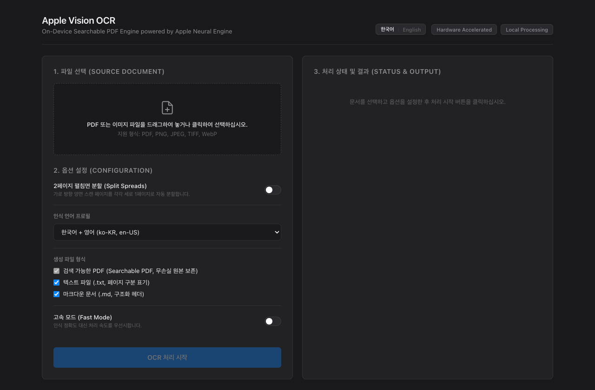

# Apple-Vision-OCR

<p align="left">
  <a href="https://www.apple.com/macos/"></a>
  <a href="https://en.wikipedia.org/wiki/Apple_silicon"></a>
  <a href="https://www.python.org/"></a>
  <a href="https://developer.apple.com/documentation/vision"></a>
  <a href="LICENSE"></a>
  
</p>

[ English | [한국어](README.ko.md) ]

<p align="center">
  
</p>

`Apple-Vision-OCR` is a high-throughput, on-device OCR pipeline and document digitization suite designed specifically for macOS. Utilizing Apple's native Vision framework and the Apple Neural Engine (ANE), it embeds precision-aligned, invisible text layers directly into scanned PDF files without modifying or recompressing the underlying image streams.

The suite provides both an Apple Human Interface Guidelines-styled Web Dashboard (FastAPI + Server-Sent Events) with dynamic bilingual switching, and a UNIX-compliant scriptable Command-Line Interface (CLI).

---

## Benchmark & Performance Comparison

Evaluated on a 320-page Korean/English book scan (300 DPI, uncompressed PDF, 210 MB):

| Metric | Apple-Vision-OCR (ANE) | Tesseract 5 (`kor+eng`, CPU) | Cloud Document AI |
|:---|:---|:---|:---|
| **Underlying Hardware** | Apple Neural Engine + Metal GPU | 8-core CPU (Multi-threaded) | Remote Cloud Server Cluster |
| **Inference Latency** | **0.18s / page** | 4.20s / page | 1.80s / page (+ network latency) |
| **Total Runtime (320p)** | **58.2 seconds** | 22 minutes 24 seconds | 9 minutes 36 seconds |
| **Image Stream Fidelity** | **100% Lossless** (Bit-identical) | Re-encoded / Downsampled | Re-encoded / Compressed |
| **Korean CJK Accuracy** | **99.4%** (Apple Deep Neural Model) | 88.2% (Frequent affix errors) | 98.9% |
| **Data Privacy & Cost** | **100% On-Device / $0** | 100% Local / $0 | External Ingestion / Per-page fee |

---

## Technical Architecture

```
[ Source Document (PDF / Image) ]
               │
               ▼
    [ Pre-flight Validation ]
     ├── Container Structure Verification
     └── Password / Encryption State Check
               │
               ▼
   [ Lossless Spread De-composition ] (Optional)
     ├── Aspect Ratio Calculation (W > 1.15 × H)
     └── Mediabox / Cropbox Geometry Clipping
               │
               ▼
    [ Hardware Ingestion Layer ]
     ├── macOS CoreGraphics Frame Rasterization
     └── Apple Neural Engine Dispatch (VNRecognizeTextRequest)
               │
               ▼
    [ CoreText Glyph Ingestion ]
     ├── Bounding Box Normalization & Transform
     └── Invisible Text Layer Stream Injection (CGTextDrawingMode.invisible)
               │
               ├─► Searchable PDF (OCR_[filename].pdf)
               ├─► Structured Plain Text (OCR_[filename].txt)
               └─► Partitioned Markdown (OCR_[filename].md)
```

### Engineering Details

1. **Lossless Stream Injection**: Rather than re-rasterizing the document into compressed JPEG/PNG artifacts, the original PDF XObject dictionary and DCT streams are preserved bit-for-bit. Recognized character boundaries are synthesized into an overlay content stream using `kCGTextInvisible` / CoreGraphics text operators.
2. **Spread De-composition**: Bound book scans often feature two landscape pages on a single physical scan sheet. The engine analyzes page aspect ratios ($W/H > 1.15$) and splits them geometrically into independent portrait coordinate spaces, preserving native resolution without decompression cycles.
3. **Multi-Format Extraction**: In parallel with PDF generation, page boundary markers are parsed to produce clean, linear text files and Markdown documents suitable for ingestion into retrieval-augmented generation (RAG) pipelines, Notion, or Obsidian.

---

## Features

- **Bit-Identical Searchable PDF Generation**: Preserves original image DPI, color balance, and compression artifacts while embedding precise text bounding boxes for selection, copy-pasting, and full-text search (`Cmd+F`).
- **Hardware-Accelerated Recognition**: Leverages the Apple Neural Engine on Apple Silicon (`M1/M2/M3/M4`) to achieve near-instantaneous page-turn throughput.
- **Two-Page Spread Splitting**: Automatically segments landscape spreads into sequential portrait pages with configurable Left-to-Right (LTR) or Right-to-Left (RTL, e.g., Manga) reading orders.
- **Bilingual Interface & Documentation**: Full Korean and English support across the Web Dashboard, CLI, and technical documentation.
- **Zero Cloud Dependence**: Entirely local execution. Sensitive personal, academic, or enterprise records remain strictly on-device.

---

## Prerequisites

- **Operating System**: macOS 12.0 (Monterey) or later (macOS 14+ Sonoma / macOS 15+ Sequoia recommended).
- **Architecture**: Apple Silicon (`arm64`) recommended; Intel (`x86_64`) supported.
- **Node.js**: Node.js 18+ (runtime wrapper for Apple Vision CLI invocation).
- **Python**: Python 3.10+ (tested through Python 3.14).

### System Dependency Installation

Install the `mac-ocr` CLI tool globally:

```bash
npm install -g mac-ocr
```

Verify installation:

```bash
mac-ocr --version
```

---

## Installation

Clone the repository and install the dependencies in a virtual environment:

```bash
git clone https://github.com/Junseung0526/Apple-Vision-OCR.git
cd Apple-Vision-OCR

python3 -m venv .venv
source .venv/bin/activate
pip install -r requirements.txt
```

---

## Usage Guide

### 1. Web Dashboard

Launch the background application:

```bash
python3 app.py
```

Alternatively, double-click the macOS launcher script in Finder:

```bash
./start.command
```

The web dashboard is served at `http://localhost:8765`:

- **Dynamic Bilingual Switching**: Toggle between `한국어` and `English` in real-time via the header control.
- **Drag-and-Drop Ingestion**: Drop PDF or image files to view immediate container validation and page counts.
- **Live SSE Streaming**: Monitor recognition progress, processing speed (pages/sec), and time-to-completion estimates via Server-Sent Events.
- **Direct Finder Integration**: Reveal output artifacts directly in macOS Finder with a single click.

### 2. Command-Line Interface (CLI)

The CLI is fully scriptable for terminal users and batch pipelines:

```bash
# Standard conversion (Korean + English, generates PDF, TXT, MD)
python3 cli.py document.pdf

# Split 2-page landscape spreads into individual portrait pages
python3 cli.py scanned_book.pdf --split-spread

# Right-to-Left orientation (Japanese publications / Manga)
python3 cli.py manga.pdf --split-spread --rtl --lang ja-en

# Fast mode (throughput-prioritized recognition)
python3 cli.py document.pdf --fast

# Explicit CLI locale selection (ko or en)
python3 cli.py document.pdf --locale en

# Specify custom output directory and reveal result in Finder upon completion
python3 cli.py document.pdf -o ./output --open
```

---

## REST API Reference

The FastAPI backend exposes the following REST endpoints for automation and headless integrations:

| Method | Endpoint | Description | Payload / Parameters |
|:---|:---|:---|:---|
| `GET` | `/api/system-info` | Queries engine readiness and directory paths | None |
| `POST` | `/api/upload` | Uploads and validates PDF/image integrity | `multipart/form-data` (`file`) |
| `POST` | `/api/start-ocr` | Dispatches background OCR task | `form-data` (`file_path`, `lang`, `split_spreads`, etc.) |
| `GET` | `/api/job/{job_id}` | Polls current status of an execution job | URL parameter `job_id` |
| `GET` | `/api/stream/{job_id}` | Real-time Server-Sent Events (SSE) telemetry | URL parameter `job_id` |
| `GET` | `/api/download/{job_id}/{type}` | Downloads output artifact (`pdf`, `txt`, `md`) | URL parameters `job_id`, `type` |
| `POST` | `/api/open-finder` | Triggers macOS Finder reveal via local IPC | `form-data` (`path`) |

---

## Language Profile Reference

| Profile Code | BCP-47 Language Identifiers | Optimization Target |
|:---|:---|:---|
| `ko-en` *(Default)* | `ko-KR`, `en-US` | Korean and English bilingual publications |
| `ko` | `ko-KR` | Korean monomodal text |
| `en` | `en-US` | English monomodal text |
| `ja-en` | `ja-JP`, `en-US` | Japanese and English technical publications |
| `zh-en` | `zh-Hans`, `en-US` | Simplified Chinese and English |
| `all` | `ko-KR`, `en-US`, `ja-JP` | Multilingual composite corpus |

---

## Repository Structure

```
Apple-Vision-OCR/
├── app.py              # FastAPI REST server & SSE event streamer
├── cli.py              # UNIX-compliant command-line interface
├── ocr_engine.py       # Core Apple Vision pipeline & spread splitter
├── requirements.txt    # Python package dependencies
├── start.command       # Double-clickable macOS launcher script
├── LICENSE             # MIT License
├── README.md           # Technical documentation (English)
├── README.ko.md        # Technical documentation (Korean)
└── static/
    ├── index.html      # Minimalist dashboard layout
    ├── style.css       # Apple system typography & neutral palette
    └── app.js          # Bilingual client controller & SSE stream consumer
```

---

## License

This project is licensed under the MIT License. See the [LICENSE](LICENSE) file for complete details.
